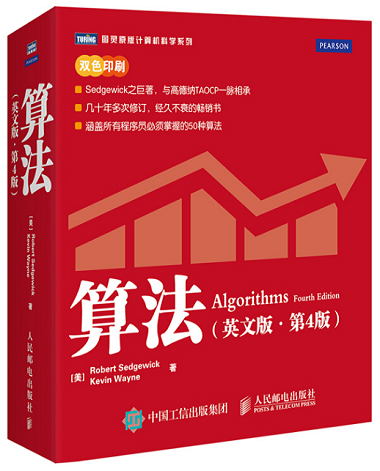

# 算法第四版（Algorithms_4th)



---------------

### Github 

[项目地址](https://github.com/DongHenry/Algorithms_4th_Python) 

### :basketball: 目录结构描述

----------------


```python
Algorithms_4th_python
|-- README.md
|-- Algorithms_4th_python
|   |-- Algorithms_4th
|       |-- Chapter_1_Foundation
|       |-- Chapter_2_Sort
|       |-- Chapter_3_Search
|       |-- Chapter_4_Graph
|       |-- Chapter_5_String
|       |-- Chapter_6_Context
|   |-- Algorithms_4thTest
|       |-- Chapter_1_Foundation
|       |-- Chapter_2_Sort
|       |-- Chapter_3_Search
|       |-- Chapter_4_Graph
|       |-- Chapter_5_String
|       |-- Chapter_6_Context
```

### :basketball: 原书配套网站

-------------------

:earth_asia:[Algorithms and Data Structures Cheatsheet](https://algs4.cs.princeton.edu/cheatsheet/) 

原书配套网站提供了关于算法和数据结构的丰富资料。

- 全书所有的Java代码
- 部分练习题答案
- 可视化的算法演示
- 提供测试数据集`algs4.data`的下载